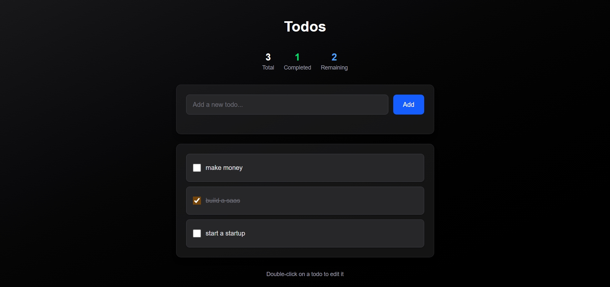

# Todos

A simple todo app built with Next.js, React, TypeScript, and Tailwind CSS.



## Features

- Add, edit, and delete todos
- Mark tasks as complete
- Data persists in localStorage
- Dark mode support

## Stack

- Next.js 16
- React 19
- TypeScript
- Tailwind CSS

## Setup

```bash
npm install
npm run dev
```

Then open http://localhost:3000

## Project Structure

```
src/
├── app/
│   └── page.tsx         # Main page
├── Components/
│   ├── TodoForm.tsx
│   ├── TodoItem.tsx
│   └── TodoList.tsx
└── Interfaces/
    └── Todo.ts
```

## How to Use

- Type in the input and hit Add
- Click checkbox to mark done
- Double-click a todo to edit it
- Hover to see delete button
